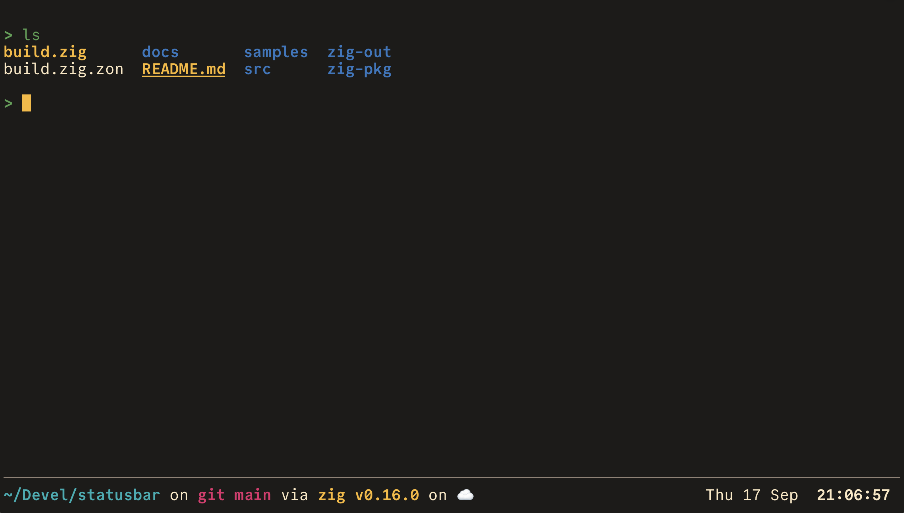

# statusbar

A status bar for any terminal. `statusbar` runs your shell in a pty one or
two rows shorter than the window, and keeps a bar in the rows it gave up at
the bottom. Full-screen programs and scrollback keep working.

```
❯ make test
…
❯
──────────────────────────────────────────────────────────────────────
 vrypan@vrypan-mbp · load 3.13                   Thu 17 Sep  18:24:31
```

- Configure the bar with templates: text, colors, strftime clocks and shell
  commands, each on its own refresh interval.
- Update it from your scripts with `statusbar set`.
- Move your starship prompt into it with one line in `~/.zshrc`.



## Build

Requires Zig 0.16 on macOS or Linux.

```sh
zig build -Doptimize=ReleaseSafe      # binary in zig-out/bin/statusbar
zig build test                        # unit tests
```

## Quick start

```sh
# The built-in bar: user, host, load, date and time
statusbar

# Your own, starting from the built-in config
mkdir -p ~/.config/statusbar
statusbar config --default > ~/.config/statusbar/config
statusbar

# Or from a single command
statusbar -e 'date "+%H:%M"'
```

Run `statusbar --help` for the commands, and `statusbar completion zsh` (or
`bash`, `fish`) for shell completions.

To put starship's prompt in the bar, add this to `~/.zshrc`:

```zsh
eval "$(statusbar init zsh)"
```

## Documentation

- [Usage](docs/usage.md): commands, options, `--exec`, completions,
  environment
- [Config file](docs/config.md): lines, slots, templates, commands, colors
  and markup
- [Updating the bar](docs/set.md): `statusbar set` and its escape sequence
- [Starship](docs/starship.md): moving the prompt into the bar
- [Internals](docs/internals.md): how it works, and its limitations
