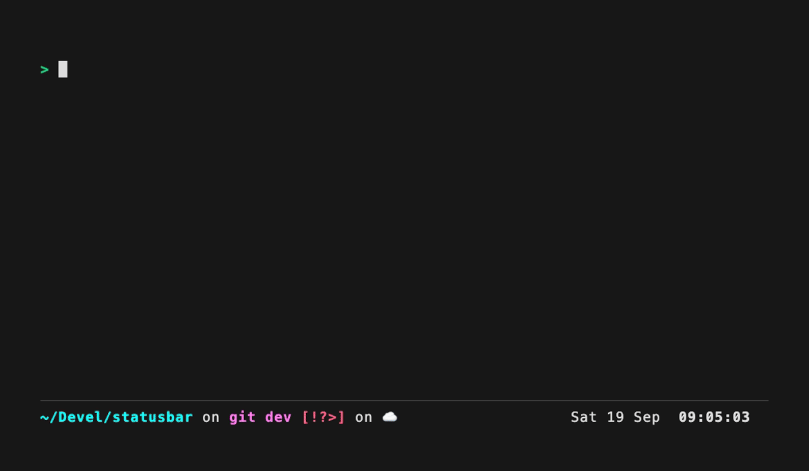

# statusbar

A status bar for any terminal. `statusbar` runs your shell in a smaller pty
and keeps configured rows at the bottom of the window. The bar yields rows
when the terminal is too short. Full-screen programs and scrollback keep
working.



- Configure the bar with templates: text, colors, strftime clocks and shell
  commands, each on its own refresh interval.
- Wrap values in `#[track]...#[notrack]` to pulse just those regions when
  their displayed content changes.
- Update it from your scripts with `statusbar set`.
- Optionally move Starship's prompt details into it while keeping the prompt
  character in the terminal.

## Build

Requires Zig 0.16 on macOS or Linux.

```sh
zig build -Doptimize=ReleaseSafe      # binary in zig-out/bin/statusbar
zig build test                        # unit tests
```

Or install a released version with Homebrew:

```sh
brew install vrypan/tap/statusbar
```

## Quick start

```sh
# The built-in bar: user, host, load, date and time
statusbar

# Your own, starting from the built-in config
mkdir -p ~/.config/statusbar
statusbar config --default > ~/.config/statusbar/config
statusbar

# Or from a single command
statusbar -e 'date "+%H:%M"'
```

Run `statusbar --help` for the commands. The [user guide](docs/README.md)
has setup instructions for shell completions.

To put Starship's prompt in the bar, add this to `~/.zshrc`:

```zsh
eval "$(statusbar init zsh)"
```

Fish uses its native prompt function; put these after one another in
`~/.config/fish/config.fish`:

```fish
starship init fish | source
statusbar init fish | source
```

## Learn more

Start with the [user guide](docs/README.md) for a practical setup: one-command
bars, personal layouts, live slots, Starship, and themes. Reference guides
cover [configuration](docs/config.md), [runtime slot updates](docs/set.md),
[Starship](docs/starship.md), and [internals and limitations](docs/internals.md).
