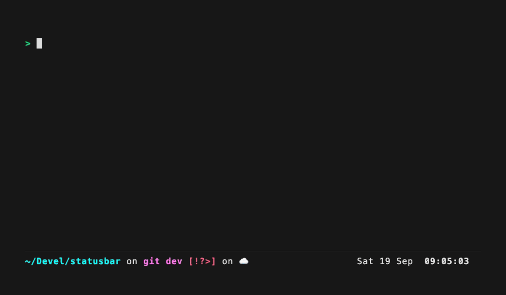

# statusbar

A status bar at the bottom of your terminal. It keeps useful information
visible while you work, without repeating it in every prompt. Your shell,
full-screen programs, and scrollback continue to work.



## Quick start

Install with Homebrew:

```sh
brew install vrypan/tap/statusbar
```

Or download the latest [release](releases/).

Or build from source with Zig 0.16 on macOS or Linux:

```sh
zig build -Doptimize=ReleaseSafe
# Binaries: zig-out/bin/statusbar and zig-out/bin/statusbar-theme
```

Then start statusbar:

```sh
statusbar
```

This starts your usual shell with a status bar.

Exit it to return to your original session.

> [!WARNING]
> **v0.5.0 breaks compatibility with older versions.**
>
> You can use the AI method bellow to have an AI agent migrate your old
> configuration, or visit [docs/migration.md](docs/migration.md) for
> manual instructions.

## Configure using an AI agent

You can use an AI agent to configure statusbar and make a personal theme.

Use a prompt like:
```
Read @AGENT_SETUP.md and follow it to help me set up my installed statusbar and create a custom theme.
```

[AGENT_SETUP.md](AGENT_SETUP.md) is at the root of a release
tarball or at `$(brew --prefix statusbar)/share/statusbar/AGENT_SETUP.md`
after a Homebrew install.

## Choose a theme

`statusbar-theme` is an interactive theme picker included with statusbar.
**Start `statusbar` first**, then open the picker inside that session:

| Installation | Open the bundled themes |
| --- | --- |
| Homebrew | `statusbar-theme` |
| Release tarball, from its extracted directory | `./bin/statusbar-theme ./themes` |
| Source build, from the repository directory | `./zig-out/bin/statusbar-theme ./zig-out/share/statusbar/themes` |

Use arrows or `j`/`k` to select a theme, then **Enter** to apply it. The
picker stays open so you can try others. Press **Esc** or **q** to close it
and keep the last applied theme.

Applying a theme changes only the current session. **To use it every time**,
run the copy command the picker prints when you exit after changing themes.

Homebrew builds find their bundled themes automatically. You can also pass
a directory of your own `.statusbar` themes:

```sh
statusbar-theme ~/.config/statusbar/themes
```

The bundled themes include versions with fixed colors and versions that
follow your terminal's palette. See [sample themes](samples/themes/README.md).
The picker uses [zooi](https://github.com/vrypan/zooi).

## Customize your bar

Edit your saved config, or create one from the built-in layout:

```sh
mkdir -p ~/.config/statusbar
statusbar config --default > ~/.config/statusbar/config.statusbar
```

After editing the file, apply it to the running session:

```sh
statusbar config < ~/.config/statusbar/config.statusbar
```

Each `[line.NAME]` section adds a named line with a template of text, dates,
command output, and styles; `#(fill: )` pushes what follows to the right.
[The guide](docs/README.md) starts with small examples. Upgrading from a
config with `left`, `right` and `rule`? See the
[migration guide](docs/migration.md).

Inside a statusbar session, scripts can change a line with
`statusbar set prompt "Ready" --status success`. For live output,
`statusbar push build -- make` adds a temporary line; `statusbar pop build`
removes it. You can also move Starship's prompt details into a statusbar line.

For shell redirection, `statusbar push build --fifo` creates a line and a
named pipe; `statusbar bind prompt` gives an existing line one.
See [FIFOs](docs/bind.md).

Run `statusbar --help` for the full command list.

## Use Starship in statusbar

To put Starship's prompt in statusbar, add this to `~/.zshrc`:

```zsh
eval "$(statusbar init zsh)"
```

This moves Starship's information into the line named `prompt` and leaves the
prompt character in the terminal. It also updates the terminal title when you
change directory. [Starship setup](docs/starship.md) covers other lines and
options.

Fish uses its native prompt function; put these after one another in
`~/.config/fish/config.fish`:

```fish
starship init fish | source
statusbar init fish | source
```

## More examples and details

The [user guide](docs/README.md) covers layouts, live updates, and themes.
See [configuration](docs/config.md), [changing lines](docs/set.md),
[temporary lines](docs/push.md), [listing lines](docs/list.md), [FIFOs](docs/bind.md), or
[how statusbar works](docs/internals.md)
when you need more detail. The guide also covers [shell completions](docs/usage.md#completion).

## How I use statusbar

[My everyday setup](docs/how-i-use-statusbar.md): a minimal Starship statusbar in
every Ghostty terminal, and an `sbx` alias to load a richer statusbar where I'm
spending time.
