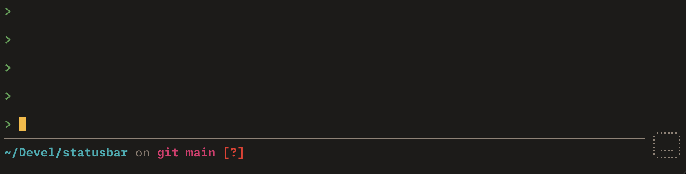
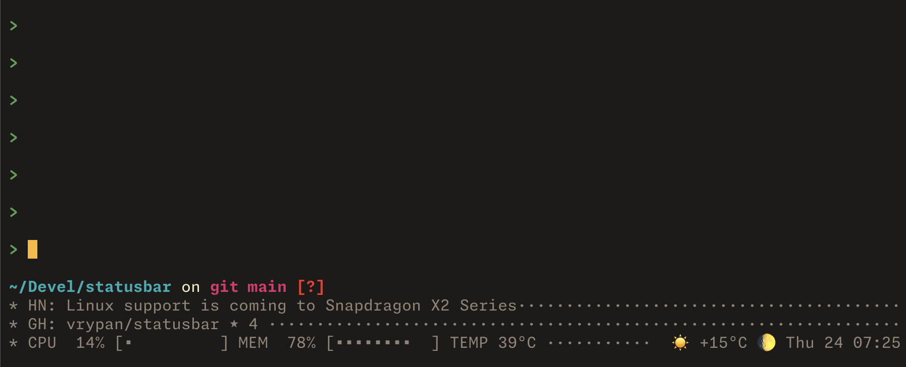

# How I use statusbar

I use statusbar in two ways: a minimal bar in every terminal, and a richer one
in the terminal where I'm actually spending time.

## A minimal default

My default config gives Starship a fixed place at the bottom of the terminal.
I can see my prompt information without adding an extra line to every prompt
in the scrollback.

The bar itself has no scheduled external commands or clock updates. Starship
updates it through the shell integration when the prompt is drawn, so the
default stays very light.

Here's my `~/.config/statusbar/config`:

```ini
interval = 5

[colors]
accent = #c792ea
muted = #737b91
blue = #82aaff


[line.1]
right = "#[fg=green]⡎⠉⠉⢱#[default]" 

[line.2]
left = "<starship placeholder>"
right = "#[fg=green]⢇⣒⣒⡸#[default]"

```

Ghostty launches my shell through statusbar. In my Ghostty config:

```ini
command = statusbar -- /bin/zsh -l
```

And in `.zshrc`, I send Starship's information to slot 3—the left side of the
second row:

```sh
eval "$(statusbar init zsh --starship-slot 3)"
```



## More information when I want it

When I settle into a terminal, I type `sbx`:

```sh
alias sbx='statusbar config < "$HOME/.config/statusbar/extra.config"'
```

This replaces the bar's config in that session, without restarting my shell.
Starship stays in the second row, and the bar grows to include the top Hacker
News story, the star count for statusbar on GitHub, CPU and memory usage,
temperature, weather, and the date and time. Tracked values briefly highlight
when they change.

<details>
<summary>This is my ~/.config/statusbar/extra.config:</summary>

```ini
interval = 5

[colors]
base = #3c3836
text = #fbf1c7
accent = #d79921
muted = #928374
pill = #504945
good = #98971a

[line.1]
rule = " "
style = fg=muted

# Slot 3 is intentionally empty here: Starship fills it.
[line.2]
left = ""
# right = "#[fg=muted] (load #(load))#[default]"
style = fg=text

[line.3]
  left = "#[track]#[fg=bold]* HN: #[default]#(hn)#[notrack]"
  right = ""
  rule = ·
  style = fg=muted

[line.4]
  left = "#[track]#[fg=bold]* GH: #[default]#(gh-statusbar-stars) #[notrack]"
  right = ""
  rule = ·
  style = fg=muted

[line.5]
  left = "#[fg=bold]*#[default] #[fg=muted]#[track]#(system-stats)#[notrack]#[default] "
  right = " #[fg=muted] #(weather) %a %d #[track]%H:%M#[notrack]"
  rule = ·
  style = fg=muted

[command.hn]
run = |
  id=$(curl -fsSL https://hacker-news.firebaseio.com/v0/topstories.json | jq -r '.[0]') || exit
  json=$(curl -fsSL https://hacker-news.firebaseio.com/v0/item/$id.json) || exit
  title=$(printf %s "$json" | jq -r '.title // empty') || exit
  printf '\033]8;;https://news.ycombinator.com/item?id=%s\033\\%s\033]8;;\033\\' "$id" "$title"
interval = 60

[command.gh-notification]
run = |
  notification=$(GH_NO_UPDATE_NOTIFIER=1 gh api notifications --cache 60s | jq -c '.[0]') || { printf 'GitHub unavailable'; exit; }
  case $notification in ''|null) printf 'Zero Inbox'; exit;; esac
  title=$(printf %s "$notification" | jq -r '"\(.repository.full_name): \(.subject.title)"')
  subject_url=$(printf %s "$notification" | jq -r '.subject.url // empty')
  url=""
  if [ -n "$subject_url" ]; then
    url=$(GH_NO_UPDATE_NOTIFIER=1 gh api "$subject_url" --jq '.html_url // empty' 2>/dev/null)
  fi
  [ -n "$url" ] || url=$(printf %s "$notification" | jq -r '.repository.html_url')
  printf '\033]8;;%s\033\\%s\033]8;;\033\\' "$url" "$title"
interval = 60

[command.gh-statusbar-stars]
run = |
  stars=$(gh repo view vrypan/statusbar --json stargazerCount -q .stargazerCount)
  printf "vrypan/statusbar ★ %s" $stars
interval = 60

[command.load]
run = uptime | awk -F'load averages?: ' '{ split($2, a, /[, ]+/); print a[1] }'
interval = 10

[command.weather]
run = curl https://wttr.in/\?format="%c%t+%m"
interval = 300

[command.system-stats]
run = |
	set -e
	set -o pipefail
	
	WIDTH=10
	
	bar() {
  	local pct=$1
  	local filled=$(( (pct * WIDTH + 50) / 100 ))
  	local i
  	printf '['
  	for (( i = 0; i < filled; i++ )); do
    	printf '▪'
  	done
  	printf '%*s' "$((WIDTH - filled))" ''
  	printf ']'
	}
	
	# Requires macmon and jq: brew install macmon jq
	for dependency in macmon jq; do
  	if ! command -v "$dependency" >/dev/null 2>&1; then
    	printf 'test.sh: missing %s; install with: brew install macmon jq\n' "$dependency" >&2
    	exit 1
  	fi
	done
	
	# One sample for all metrics. CPU is frequency-scaled usage across all cores;
	# memory is macmon's used RAM / total RAM; temperature is the CPU average.
	metrics=$(macmon pipe --samples 1 | jq -er '
  	def number: if type == "number" then . else error("missing metric") end;
  	def percent: . * 100 | round | if . < 0 then 0 elif . > 100 then 100 else . end;
  	[
    	(.cpu_scaled_ratio | number | percent),
    	((.memory.ram_usage | number) / (.memory.ram_total | number) | percent),
    	(.temp.cpu_temp_avg | number | round)
  	] | @tsv
	')
	read -r cpu_used mem_pct temp <<< "$metrics"

	printf 'CPU %3d%% ' "$cpu_used"
	bar "$cpu_used"
	printf ' MEM %3d%% ' "$mem_pct"
	bar "$mem_pct"
	printf ' TEMP %s°C\n' "$temp"
interval = 30

```

</details>

This is my actual config, including commented experiments and unused command
definitions. It uses `curl`, `jq`, `gh`, and `macmon`; `gh` is authenticated on
my machine.



Most terminals keep the small bar. The one I'm spending time in gets the extra
information, with a single command.
