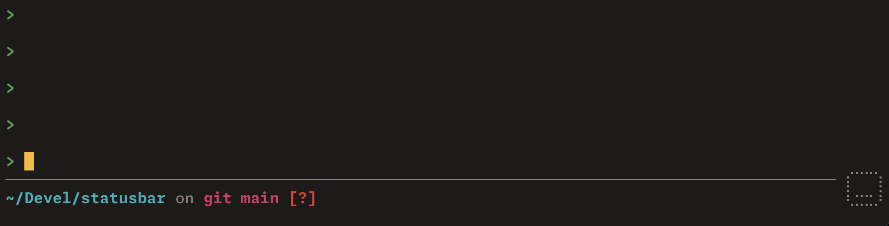
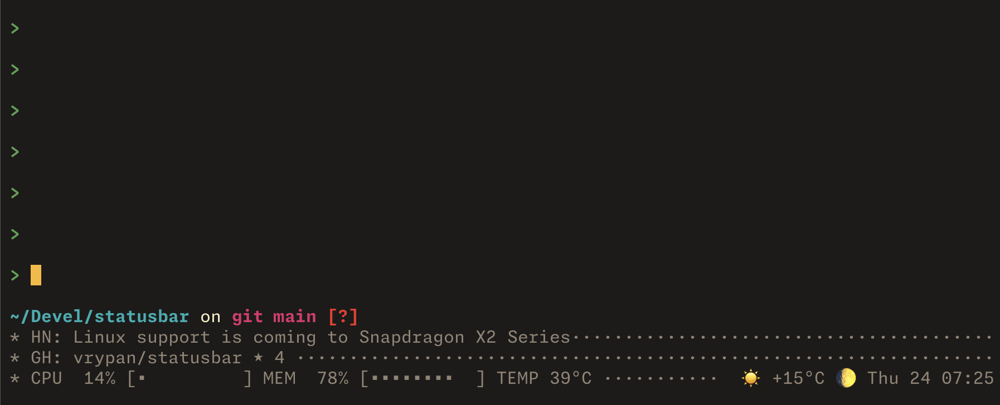

# How I use statusbar

I use statusbar in two ways: a minimal statusbar in every terminal, and a richer one
in the terminal where I'm actually spending time.

## A minimal default

My default config gives Starship a fixed place at the bottom of the terminal.
I can see my prompt information without adding an extra line to every prompt
in the scrollback.

The statusbar itself has no scheduled external commands or clock updates. Starship
updates it through the shell integration when the prompt is drawn, so the
default stays very light.

Here's my `~/.config/statusbar/config.statusbar`:

```ini
# minimal: shared muted labels and dotted fills.
# Colors follow the terminal palette; minimal-color.stbt uses fixed colors.

interval = 5

[colors]
text = default
muted = colour8
rule = colour8
accent = colour3
success = colour10
failure = colour1

[line.rule]
text = "#[fg=rule,dim]#(fill:─)#[default]"

[line.prompt]
default = "Ready"
text = "#[fg=text]#(value)#[default]"

# Temporary lines use the same muted labels as modules.
[push]
keep = left
spinner = "⠋⠙⠹⠸⠼⠴⠦⠧⠇⠏"
text = "#[fg=accent]#(spinner)#[default,fg=muted] #[bold]#(name)#[nobold] › #(value) #[default,fg=rule,dim]#(fill:·)#[default]"
done = "#[fg=muted]· #[bold]#(name)#[nobold] › #(value) #[default,fg=rule,dim]#(fill:·)#[default]"
success = "#[fg=success]✔#[default,fg=muted] #[bold]#(name)#[nobold] › #(value) #[default,fg=rule,dim]#(fill:·)#[default]"
failed = "#[fg=failure]✗#[default,fg=muted] #[bold]#(name)#[nobold] › #(value) #[default,fg=rule,dim]#(fill:·)#[default,fg=failure] failed#[default]"
```

Ghostty launches my shell through statusbar. In my Ghostty config:

```ini
command = statusbar -- /bin/zsh -l
```

And in `.zshrc`, I send Starship's information to the `prompt` line, which
replaces the `Ready` fallback:

```sh
eval "$(statusbar init zsh)"
```



## More information when I want it

When I settle into a terminal, I type `sbx`:

```sh
alias sbx='statusbar config < "$HOME/.config/statusbar/extra.stbt"'
```

This replaces statusbar's config in that session, without restarting my shell.
Starship stays in the second line, and statusbar grows to include the top Hacker
News story, the latest unread GitHub notification, system load, weather,
and the date and time. Tracked values briefly highlight
when they change.

<details>
<summary>This is my ~/.config/statusbar/extra.stbt:</summary>

```ini
# multi-line: shared muted labels and dotted fills.
# Colors follow the terminal palette; multi-line-color.stbt uses fixed colors.
# Commands: curl, jq, gh (authenticated), uptime, awk; network access.

interval = 5

[colors]
text = default
muted = colour8
rule = colour8
accent = colour3
success = colour10
failure = colour1

[line.rule]
text = "#[fg=rule,dim]#(fill:─)#[default]"

[line.prompt]
text = "#[fg=text]#(value)#[default]"

[line.hn.top]
default = "#[track]#(command:hn.top)#[notrack]"
text = "#[default,fg=muted,bold]* HN: #[nobold]#(value) #[default,fg=rule,dim]#(fill:·)#[default]"

[line.gh.notifications]
default = "#[track]#(command:gh.notifications)#[notrack]"
text = "#[default,fg=muted,bold]* GitHub: #[nobold]#(value) #[default,fg=rule,dim]#(fill:·)#[default]"

[line.system.now]
default = "load #[track]#(command:system.load)#[notrack]"
text = "#[default,fg=muted,bold]* System: #[nobold]#(value) #[default,fg=rule,dim]#(fill:·)"
text .= "#[default,fg=muted] #(command:system.weather) #(datetime:%a %d) #[track]#(datetime:%H:%M)#[notrack]#[default]"

# Temporary lines use the same muted labels as modules.
[push]
keep = left
spinner = "⠋⠙⠹⠸⠼⠴⠦⠧⠇⠏"
text = "#[fg=accent]#(spinner)#[default,fg=muted] #[bold]#(name)#[nobold] › #(value) #[default,fg=rule,dim]#(fill:·)#[default]"
done = "#[fg=muted]· #[bold]#(name)#[nobold] › #(value) #[default,fg=rule,dim]#(fill:·)#[default]"
success = "#[fg=success]✔#[default,fg=muted] #[bold]#(name)#[nobold] › #(value) #[default,fg=rule,dim]#(fill:·)#[default]"
failed = "#[fg=failure]✗#[default,fg=muted] #[bold]#(name)#[nobold] › #(value) #[default,fg=rule,dim]#(fill:·)#[default,fg=failure] failed#[default]"

[command.hn.top]
run = |
  id=$(curl -fsSL https://hacker-news.firebaseio.com/v0/topstories.json | jq -r '.[0]') || exit
  json=$(curl -fsSL https://hacker-news.firebaseio.com/v0/item/$id.json) || exit
  title=$(printf %s "$json" | jq -r '.title // empty') || exit
  printf '\033]8;;https://news.ycombinator.com/item?id=%s\033\\%s\033]8;;\033\\' "$id" "$title"
interval = 60

[command.gh.notifications]
run = |
  notification=$(GH_NO_UPDATE_NOTIFIER=1 gh api notifications --cache 60s | jq -c '.[0]') || { printf 'GitHub unavailable'; exit; }
  case $notification in ''|null) printf 'Zero Inbox'; exit;; esac
  title=$(printf %s "$notification" | jq -r '"\(.repository.full_name): \(.subject.title)"')
  subject_url=$(printf %s "$notification" | jq -r '.subject.url // empty')
  url=""
  if [ -n "$subject_url" ]; then
    url=$(GH_NO_UPDATE_NOTIFIER=1 gh api "$subject_url" --jq '.html_url // empty' 2>/dev/null)
  fi
  [ -n "$url" ] || url=$(printf %s "$notification" | jq -r '.repository.html_url')
  printf '\033]8;;%s\033\\%s\033]8;;\033\\' "$url" "$title"
interval = 60

[command.system.load]
run = uptime | awk -F'load averages?: ' '{ split($2, a, /[, ]+/); print a[1] }'
interval = 10

[command.system.weather]
run = curl https://wttr.in/\?format="%c%t+%m"
interval = 300
```

</details>

This config uses `curl`, `jq`, an authenticated `gh`, `uptime`, and `awk`.
Hacker News, GitHub, and weather need network access.



Most terminals keep the small statusbar. The one I'm spending time in gets the extra
information, with a single command.
